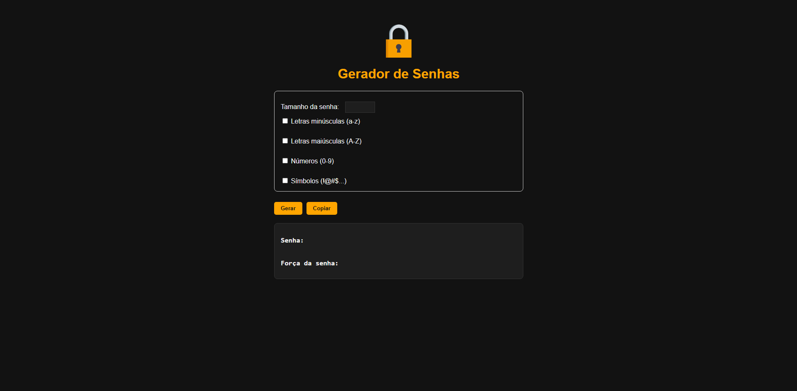
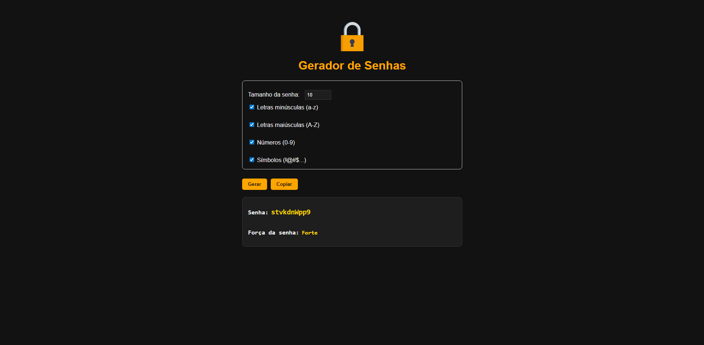

[](https://developer.mozilla.org/pt-BR/docs/Web/HTML)&nbsp;
[](https://developer.mozilla.org/pt-BR/docs/Web/CSS)&nbsp;
[](https://developer.mozilla.org/pt-BR/docs/Web/JavaScript)&nbsp;
[](LICENSE)

# 🔐 Gerador de Senhas

Gerador de senhas com avaliação de força feito em **HTML**, **CSS** e **JavaScript**.  

---

## 🖼️ Preview

*Interface inicial do gerador de senhas.*


*Exemplo de senha gerada e força da senha.*

---
## ⚙️ Funcionalidades

- 🔹 Gerar senhas seguras com letras minúsculas, maiúsculas, números e símbolos.
- 💪 Avaliação da força da senha gerada.
- 📋 Copiar senha para a área de transferência.
- 🎨 Interface simples, intuitiva e responsiva.
- 🌙 Tema dark mode com cores destacadas para melhor visualização.
---

## 🛠️ Tecnologias

- HTML5
- CSS3
- JavaScript (ES6)

---

## 🚀 Como usar

**1**. Abra o arquivo `index.html` no seu navegador.

**2**. Selecione as opções de caracteres que deseja incluir na senha.

**3**. Defina o tamanho da senha.

**4**. Clique em **Gerar** para criar a senha.

**5**. Clique em **Copiar** para copiar a senha gerada para a área de transferência.

---

## 📁 Estrutura de pastas

```
/project-root
│
├── index.html
├── styles/
│ └── style.css
├── javascript/
│ └── script.js
└── image/
└── cadeado.png
```

---

## 🤝 Contribuições

Contribuições são sempre bem-vindas! Se você quiser melhorar este projeto, siga estes passos:
**1**. Faça um fork do repositório.

**2**. Crie uma branch para a sua feature: 
```
git checkout -b minha-feature.
```
**3**. Faça suas alterações e commits:
```
git commit -m "Adicionando minha feature".
```
**4**. Faça push para a sua branch: 
```
git push origin minha-feature.
```
**5**. Abra um Pull Request.

---

## 🚧 Melhorias Futuras

- Implementar animações ou efeitos visuais para indicar a força da senha.
- Criar versões em outros idiomas.

---

## ✍🏼 Autor
Davi Cavalcante

---

## 📄 Licença
Este projeto está licenciado sob a licença MIT. Veja o arquivo [LICENSE](LICENSE) para mais detalhes.
